# Aetherfield

> **Durable Product & Engineering Charter**  
> This document defines the long-lived product intent, engineering principles, agent responsibilities, architectural constraints, documentation standards, and roadmap philosophy for Aetherfield.
>
> It is **not an execution plan for a single agent run**. Astra should read this document as persistent project context and execute work through smaller milestone-specific prompts.

---

## 1. Project Identity

| Property | Value |
|---|---|
| Product | **Aetherfield** |
| Plugin name | **Aetherfield** |
| Repository | `aetherfield` |
| Root folder | `aetherfield/` |
| Initial format | AUv3 audio effect |
| Initial platforms | iOS / iPadOS |
| DSP core | Platform-independent C++ where practical |
| Product category | Ambient / textural algorithmic reverb and spatial processor |
| Development model | Agentic, milestone-driven engineering |
| Project status | Greenfield |

**Aetherfield** is a working product name and has not necessarily undergone trademark, App Store, package-name, domain, or repository-name clearance.

---

# 2. Product Mission

Aetherfield is an original ambient and textural reverb designed to transform relatively simple source material into deep, spacious, slowly evolving sound fields.

Creative reference territory includes products such as:

- Strymon Cloudburst
- Strymon NightSky
- Strymon BigSky MX
- Valhalla Supermassive

These are **creative references, not implementation specifications**.

Do not clone, reverse engineer, or attempt to reproduce proprietary algorithms.

Instead, use the broader musical territory as inspiration:

- enormous ambient spaces
- exceptionally long decays
- dense diffusion
- evolving modulation
- blooming tails
- textural transformations
- freeze / infinite sustain
- pitch-related ambience
- spectral evolution
- unusual spatial behavior
- playable macro controls
- transformation of simple inputs into evolving sonic environments

Aetherfield must develop its **own DSP architecture and sonic identity**.

---

# 3. Product Philosophy

Aetherfield should initially behave less like a collection of unrelated reverb algorithms and more like a **single flexible reverberant instrument**.

Prefer one underlying architecture capable of traversing perceptual regions such as:

**Space → Bloom → Cloud → Infinite → Evolving Texture**

rather than implementing independent algorithms for every sound.

The architecture should expose musically meaningful behavior rather than implementation details.

A parameter such as `Texture` should eventually manipulate coordinated characteristics of the reverberant field rather than merely switching on an unrelated effect.

The first release does not need to cover the entire eventual sonic territory.

A smaller architecture that sounds exceptional is preferable to a broad architecture that sounds mediocre.

---

# 4. Primary Engineering Goal

Build the smallest technically excellent foundation that can ultimately become a distinctive ambient/textural AUv3 reverb.

Prioritize, approximately in this order:

1. sound quality
2. DSP architecture
3. numerical stability
4. real-time safety
5. modularity
6. testability
7. parameter smoothing
8. predictable feedback behavior
9. practical mobile CPU usage
10. deterministic builds and tests
11. understandable architecture
12. fast DSP experimentation
13. future extensibility

Do **not** prioritize:

- feature parity with commercial reverbs
- large preset libraries
- elaborate graphics during early development
- dozens of algorithms
- speculative abstractions
- unnecessary dependencies
- premature optimization
- excessive documentation
- architecture without audible benefit
- implementing every interesting DSP idea
- premature multi-engine designs
- pitch processing before the core reverb is compelling

---

# 5. Development Philosophy

Develop Aetherfield **inside-out**.

The preferred progression is:

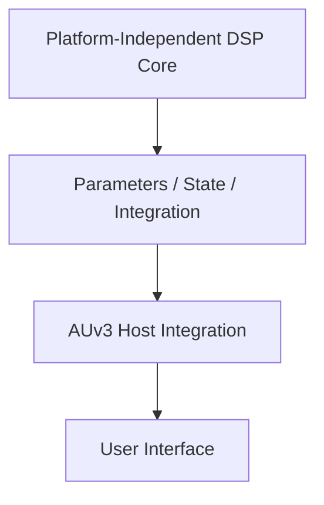

The DSP should be testable and auditionable without requiring an AUv3 host.

A fast offline DSP loop is a first-class engineering capability:


AUv3 integration should wrap a proven DSP processor rather than becoming the environment in which fundamental DSP experimentation must occur.

---

# 6. Agentic Engineering Model

Astra is the supervising technical director.

Sol, Terra, and Luna are specialist engineering resources.

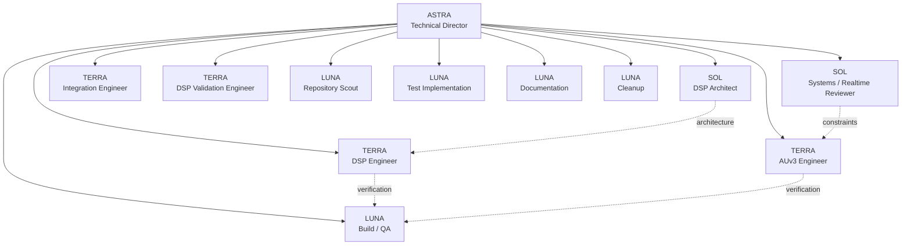

Astra owns final synthesis.

Sub-agents advise, analyze, implement, or verify.

They do not independently redefine the product.

---

# 7. Model Routing Strategy

Do not default every difficult-looking task to Sol.

Use the least expensive model appropriate to the reasoning required while escalating when uncertainty, architectural consequence, or failure risk warrants it.

## Astra — Technical Director

Own:

- project decomposition
- orchestration
- milestone definition
- cross-domain synthesis
- architectural coherence
- scope control
- conflict resolution
- roadmap maintenance
- acceptance decisions

Astra should coordinate rather than duplicate every specialist's work.

---

## Sol — Architect / Critical Reviewer

Use Sol selectively where mistakes would propagate deeply through the system or substantial DSP/architectural reasoning is required.

Typical Sol work:

- DSP topology
- feedback mathematics
- stability reasoning
- diffusion architecture
- modulation architecture
- realtime architecture
- major parameter semantics
- difficult architectural debugging
- consequential tradeoffs
- critical implementation review

Sol should generally **design or review critical systems** rather than perform large quantities of routine implementation.

---

## Terra — Default Engineering Agent

Terra is the default working engineering model.

Use Terra for:

- DSP implementation
- repository-scale reasoning
- AUv3 implementation
- integration
- debugging
- contained refactoring
- test architecture
- DSP analysis tooling
- offline rendering
- medium-complexity design decisions
- engineering documentation
- implementation feasibility analysis

---

## Luna — Bounded / Verifiable Work

Use Luna for inexpensive, bounded and mechanically verifiable work:

- repository inventory
- targeted searches
- filesystem inspection
- build execution
- test execution
- straightforward test implementation
- diagnostics
- documentation maintenance
- repetitive code changes
- artifact verification
- cleanup identification

---

# 8. Escalation Rules

Escalate **Luna → Terra** when:

- implementation requires engineering judgment
- failures have ambiguous causes
- several modules must be reasoned about together
- tests reveal unexpected DSP behavior
- changes affect module interfaces
- the task is no longer mechanically verifiable

Escalate **Terra → Sol** when:

- changing fundamental DSP topology
- changing feedback mathematics
- numerical stability is uncertain
- realtime architecture is affected
- public parameter semantics substantially change
- several plausible architectures have consequential tradeoffs
- repeated implementation attempts fail
- a decision substantially constrains future architecture

Astra resolves disagreements.

Do not resolve disagreements by implementing every proposal.

---

# 9. Specialist Roles

## Sol — DSP Architect

Own or critically review:

- late-reverb topology
- FDN topology
- feedback matrices
- diffusion architecture
- decay mathematics
- modulation architecture
- damping architecture
- stability analysis
- freeze architecture
- eventual pitch/spectral feedback architecture

---

## Sol — Systems / Realtime Reviewer

Review:

- audio-thread safety
- threading
- parameter communication
- state transitions
- memory ownership
- AUv3 lifecycle
- architectural boundaries
- consequential integration changes

---

## Terra — DSP Engineer

Implement approved:

- delay lines
- interpolation
- filters
- allpass diffusion
- FDN components
- modulators
- smoothing
- stereo processing
- freeze transitions
- Bloom mechanisms
- Texture mechanisms

Terra may propose localized improvements.

Fundamental topology changes should be escalated.

---

## Terra — AUv3 Engineer

Own implementation of:

- Audio Unit integration
- parameters
- state persistence
- host interaction
- channel configuration
- sample-rate changes
- UI/DSP communication
- build integration

---

## Terra — Integration Engineer

Own:

- module integration
- debugging
- contained refactoring
- build failures
- dependency boundaries
- implementation-level architectural consistency

---

## Terra — DSP Validation Engineer

Own:

- offline renderer
- impulse-response analysis
- RT60 estimation
- spectral diagnostics
- stereo correlation
- parameter sweeps
- stress testing
- regression analysis
- reference-render infrastructure

---

## Luna — Repository Scout

Inspect:

- repository structure
- dependencies
- conventions
- existing DSP
- tests
- build system
- reusable components
- relevant technical debt

---

## Luna — Build / QA Agent

Continuously:

- compile
- run tests
- collect warnings
- reproduce failures
- verify artifacts
- report evidence

---

## Luna — Test Implementation Agent

Implement clearly specified deterministic tests.

---

## Luna — Documentation Curator

Keep documentation synchronized with accepted architecture and decisions.

Never invent architecture.

---

## Luna — Cleanup Agent

After appropriate milestones identify:

- dead code
- abandoned experiments
- obsolete comments
- duplicated utilities
- stale documentation

Never delete questionable code without review.

---

# 10. Delegation Contract

Every meaningful delegated task should specify:

- objective
- exact scope
- files/directories that may be modified
- files/directories that must not be modified when relevant
- architectural constraints
- dependencies
- expected output
- acceptance criteria
- evidence required

Agents should return evidence rather than simply reporting:

> completed

Useful evidence includes:

- build output
- test results
- measurements
- changed files
- rendered artifacts
- identified risks
- unresolved questions

Do not create sub-agents merely to increase parallelism.

---

# 11. Core DSP Architectural Hypothesis

The following architecture is a **hypothesis, not a requirement**:

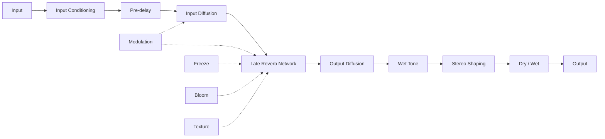

A strong candidate for the late network is an FDN or related feedback-delay architecture featuring:

- multiple mutually coupled delay lines
- mathematically stable feedback matrix
- delay lengths selected to reduce obvious periodicity
- frequency-dependent decay
- damping inside feedback loops
- very slow modulation
- decorrelated stereo extraction
- diffusion around the network
- explicit runaway-feedback safeguards

The DSP Architect should compare this with credible alternatives before committing.

Select the **simplest architecture capable of achieving the sonic target**.

---

# 12. Candidate FDN Concept

A possible conceptual topology:

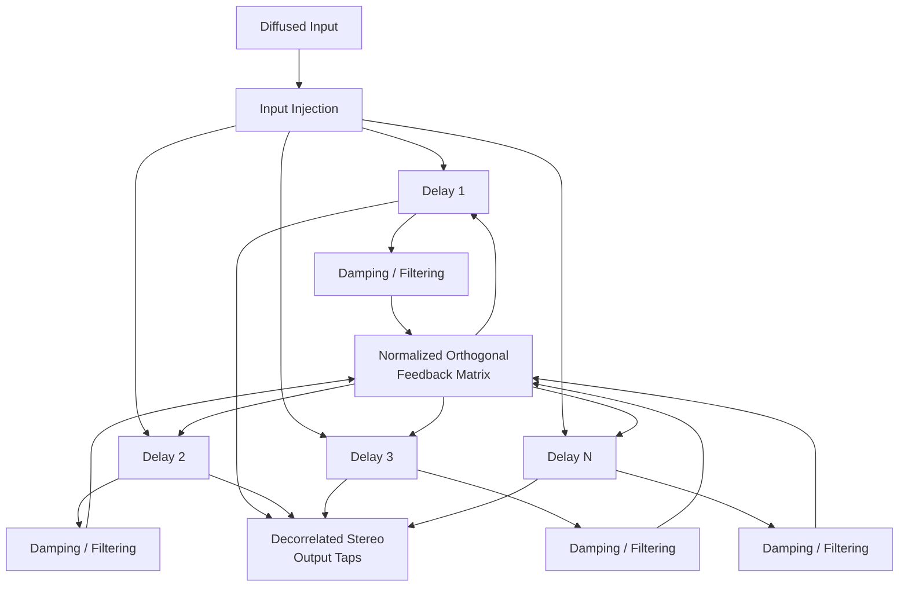

This is not an implementation mandate.

Once implemented, documentation must show the **actual topology**, not this original hypothesis.

---

# 13. Sonic Targets

The eventual architecture should cover several related sonic regions.

## Large Space

Smooth, spacious, expensive-sounding long reverberation without obvious metallic ringing.

## Bloom

A tail that appears to expand or emerge after the transient rather than simply decay.

## Cloud

Dense, diffuse, slowly moving texture.

## Infinite

Stable sustained ambience capable of freeze-like behavior without uncontrolled numerical growth.

## Modulated Space

Slow evolution that reduces static coloration without producing obvious chorus unless intentionally increased.

Do not create five independent algorithms unless evidence demonstrates that a unified architecture cannot adequately cover this space.

---

# 14. Parameter Philosophy

Keep the initial public parameter surface intentionally small.

Candidate controls include:

- Mix
- Decay
- Size
- Pre-delay
- Diffusion
- Mod Depth
- Mod Rate
- Low Damp
- High Damp
- Texture
- Bloom
- Width
- Freeze

These are candidates, not requirements.

The architecture team should determine which are justified.

Prefer perceptually meaningful macro controls over implementation details.

Every continuous parameter requires:

- meaningful range
- meaningful units where appropriate
- perceptually appropriate mapping
- smoothing strategy
- realtime-safe implementation
- automation behavior
- extreme-value testing

Automation must not introduce clicks or destabilize feedback structures.

---

# 15. Texture Philosophy

`Texture` should not simply mean "add noise."

Investigate whether Texture can progressively coordinate some combination of:

- additional diffusion
- feedback modulation
- micro-pitch variation
- spectral smearing
- decorrelated taps
- pitch-shifted feedback
- nonlinear diffusion
- altered feedback distribution

The initial implementation does not need all of these.

Choose the **smallest mechanism producing the greatest audible improvement**.

A possible long-term perceptual dimension is:

**Clean → Diffuse → Moving → Smeared → Ethereal**

This is a research direction, not a predetermined implementation.

---

# 16. Bloom Philosophy

Bloom should create the perception that reverberant energy develops after the original transient.

Potential mechanisms include:

- time-varying diffusion
- envelope-shaped wet injection
- delayed feedback-energy growth
- nested diffusion
- progressive feedback routing
- modulation-depth evolution

Evaluate candidates according to:

1. sound
2. stability
3. comprehensibility
4. computational cost

Do not add architectural complexity merely because a technique is interesting.

---

# 17. Freeze / Infinite Philosophy

Freeze is a DSP state.

Do not implement it merely as:

```text
feedback = 1.0
```

Explicitly design:

- input injection during freeze
- damping behavior
- modulation behavior
- normalization
- transition into freeze
- transition out of freeze
- automation while frozen
- decay behavior after release

Transitions should remain smooth and musically useful.

---

# 18. Pitch and Spectral Processing

Pitch shifting is **not part of the V0 baseline**.

The first major objective is to prove that Aetherfield is an excellent reverb before adding shimmer, octave feedback, spectral regeneration, granular processing, or similar effects.

Future research may investigate:

- micro-pitch feedback
- octave feedback
- interval feedback
- spectral feedback
- frequency-dependent regeneration
- granular diffusion
- spectral diffusion

These require explicit architectural review before implementation.

---

# 19. Real-Time Requirements

The audio render thread must never intentionally perform:

- dynamic allocation
- locks
- file I/O
- logging
- blocking synchronization
- UI work

Avoid abstractions containing hidden allocations in the render path.

DSP state transitions must be realtime safe.

Parameter communication between host/UI and DSP must be lock-free or otherwise demonstrably realtime safe.

---

# 20. Numerical Safety

Every feedback structure must explicitly consider:

- maximum loop gain
- filter gain
- interpolation behavior
- feedback-matrix normalization
- modulation effects on effective delay
- denormals
- NaN propagation
- Inf propagation
- extreme parameter combinations
- sample-rate changes
- initialization
- reset behavior

Never accept:

> It seems stable.

Require evidence.

---

# 21. Offline DSP Validation

Before substantial UI work, establish an offline DSP test and rendering harness.

It should eventually render:

- impulses
- sine waves
- noise
- silence
- transients
- short percussion
- tonal plucks
- sustained material

Generate WAV artifacts when human audition is useful.

Analyze where practical:

- peak
- RMS
- decay envelope
- approximate RT60
- stereo correlation
- spectral distribution
- output bounds

Measurements supplement listening.

They do not substitute for listening.

---

# 22. Reference Evaluation Corpus

Maintain a small deterministic evaluation corpus.

Representative sources should eventually include:

- impulse
- piano-like transient
- synth pluck
- sustained pad
- percussion transient
- broadband noise
- silence

Consequential DSP changes should follow approximately:

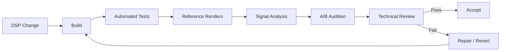

Do not regenerate accepted reference baselines merely to make tests pass.

Changes to baselines require justification.

---

# 23. AUv3 Architecture

Target modern Apple platforms and AUv3.

Keep core DSP platform-independent where practical.

Apple-specific integration should remain outside the DSP core.

Conceptually:

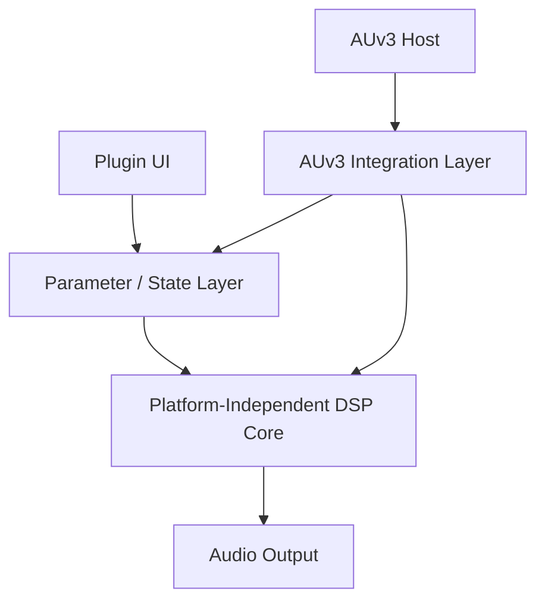

Framework selection is an architectural decision.

JUCE, native Apple APIs, CMake, Xcode, Swift/Objective-C++, or other technologies should not be selected merely because they are familiar.

Evaluate realistic alternatives according to:

- AUv3 support
- iOS/iPadOS development
- C++ DSP isolation
- offline testability
- build reproducibility
- agentic development
- dependency burden
- maintainability

Record consequential framework decisions as ADRs.

---

# 24. Repository Philosophy

Because Aetherfield begins greenfield, do not create a large speculative repository scaffold before the architecture requires it.

A possible mature structure is:

```text
aetherfield/
├── README.md
├── AETHERFIELD_SPEC.md
├── LICENSE
├── CMakeLists.txt
│
├── docs/
│   ├── architecture.md
│   ├── dsp-design.md
│   ├── testing.md
│   ├── decisions.md
│   └── roadmap.md
│
├── src/
│   ├── dsp/
│   ├── plugin/
│   └── ui/
│
├── tests/
│   ├── dsp/
│   ├── integration/
│   └── fixtures/
│
├── tools/
│   └── render/
│
└── artifacts/
    └── renders/
```

This is a **possible destination**, not a Phase 0 checklist.

Create directories and abstractions only when actual requirements justify them.

---

# 25. Documentation

The repository is the durable source of architectural knowledge.

Maintain, when appropriate:

### `README.md`

Concise project introduction and build/use instructions.

### `AETHERFIELD_SPEC.md`

This durable charter.

### `docs/architecture.md`

Actual system architecture and ownership boundaries.

### `docs/dsp-design.md`

Actual DSP topology, algorithms, parameter relationships, and relevant mathematics.

### `docs/testing.md`

Testing strategy, evaluation corpus, measurements, and validation procedures.

### `docs/decisions.md`

Architectural Decision Records.

### `docs/roadmap.md`

Current and future development direction.

Documentation must distinguish:

- **IMPLEMENTED**
- **PLANNED**
- **EXPERIMENTAL**
- **DEFERRED**
- **REJECTED**

Never describe speculative architecture as implemented.

---

# 26. Mermaid Documentation Standard

Use Mermaid when relationships, lifecycle, signal flow, ownership, dependencies, or sequencing become clearer visually.

Prefer Mermaid over ASCII diagrams for architectural relationships.

As the project matures, documentation should normally contain diagrams for:

- system architecture
- audio signal flow
- internal late-reverb topology
- testing lifecycle
- roadmap dependencies

Diagrams must evolve with implementation.

Do not leave diagrams showing superseded architecture as though it were current.

---

# 27. Architectural Decision Records

`docs/decisions.md` is durable architectural memory.

Record consequential decisions such as:

- framework/toolchain
- DSP boundary
- FDN line count
- feedback matrix
- delay interpolation
- modulation strategy
- diffusion topology
- damping architecture
- parameter semantics
- smoothing strategy
- freeze implementation
- threading boundaries

Use:

```markdown
## ADR-XXX — Decision Title

**Status:** Accepted | Experimental | Superseded | Rejected

### Context

What problem required a decision?

### Alternatives

What realistic approaches were considered?

### Decision

What was selected?

### Rationale

Why?

### Evidence

Tests, measurements, listening observations, prototypes, or constraints.

### Consequences

What does this enable or constrain?

### Revisit When

What evidence or future requirement would justify reconsidering it?
```

Do not create ADRs for trivial implementation choices.

---

# 28. Architectural Memory

Agent conversations are ephemeral.

Repository artifacts are durable.

When an agent discovers something important, ensure it becomes one of:

- implementation
- automated test
- ADR
- `architecture.md`
- `dsp-design.md`
- `testing.md`
- `roadmap.md`

before considering the knowledge safely captured.

Future agents should be able to reconstruct project reasoning from the repository rather than depending on previous conversations.

---

# 29. Agentic Engineering Rules

Treat the repository as source of truth.

Before modifying an existing subsystem, inspect it.

Keep tasks small enough for reliable agent reasoning.

Prefer changes that are:

- independently buildable
- independently testable
- reviewable
- revertible

Do not perform giant refactors.

Do not rewrite working code merely for stylistic consistency.

Do not create abstractions until concrete needs justify them.

Do not create speculative infrastructure.

Delete abandoned experiments after review.

Keep the repository cleaner after each milestone.

---

# 30. Recommendation Handling

Useful recommendations must not disappear into agent transcripts.

Every material recommendation should eventually be:

1. implemented now;
2. added to `roadmap.md`; or
3. explicitly rejected with rationale.

Agents may recommend future work.

Recommendations do not automatically expand current scope.

---

# 31. Roadmap Philosophy

Maintain `docs/roadmap.md`.

Organize work into:

## NOW

Required for the current milestone.

## NEXT

High-confidence improvements directly building upon accepted architecture.

## LATER

Promising capabilities that are not currently necessary.

## RESEARCH

Ideas requiring experimentation before architectural commitment.

## NOT PLANNED

Ideas deliberately excluded because their value does not currently justify their complexity or they conflict with product direction.

Substantial roadmap items should capture:

- objective
- audible/user benefit
- architectural dependency
- estimated complexity: S / M / L / XL
- primary risk
- suggested agent/model
- acceptance criterion

Do not assign dates unless explicitly requested.

The roadmap must not become an unrestricted feature wishlist.

---

# 32. High-Level Product Roadmap

The current long-term hypothesis is:

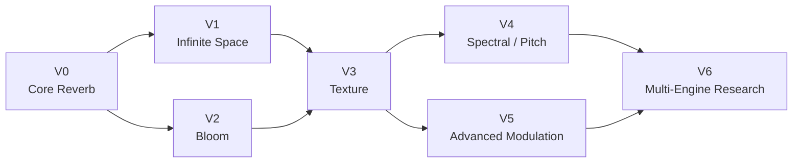

This roadmap may change based on evidence.

---

# 33. V0 — Core Reverb

Initial target:

**Pre-delay → diffusion → modulated late network → frequency-dependent decay → stereo decorrelation → wet tone → mix**

Goal:

> The reverb should be worth playing before exotic features exist.

V0 should emphasize:

- smooth density
- long stable decay
- absence of obvious ringing
- natural stereo width
- subtle movement
- useful Size/Decay relationships
- musical damping
- robust automation
- numerical stability

Likely agents:

- Sol DSP Architect
- Terra DSP Engineer
- Terra DSP Validation Engineer
- Luna Build / QA

---

# 34. V1 — Infinite Space

Implement musically useful Freeze / Infinite behavior.

Research energy-preserving transitions rather than merely forcing feedback toward unity.

Focus on:

- smooth entry
- smooth release
- controllable input injection
- spectral stability
- modulation during freeze
- useful automation

---

# 35. V2 — Bloom

Develop controllable delayed development of reverberant energy.

Compare approaches such as:

- injection-envelope techniques
- evolving diffusion
- feedback-energy shaping

Select according to listening evidence, stability, computational cost, and architectural simplicity.

---

# 36. V3 — Texture

Develop Texture as a macro perceptual dimension.

Potential direction:

**Clean → Diffuse → Moving → Smeared → Ethereal**

Texture should preferably manipulate the existing reverberant architecture rather than simply place an unrelated effect after it.

---

# 37. V4 — Spectral / Pitch

**Research before implementation.**

Potential investigations:

- micro-pitch feedback
- octave/shimmer feedback
- interval feedback
- spectral feedback
- frequency-dependent regeneration
- granular/spectral diffusion

Do not implement merely because reference products contain related capabilities.

Require evidence that the mechanism strengthens Aetherfield's own identity.

---

# 38. V5 — Advanced Modulation

Investigate long-timescale evolution such as:

- multiple independent LFOs
- random walk
- filtered stochastic modulation
- diffusion modulation
- feedback-distribution modulation
- extremely slow parameter evolution

A useful target is reverberant tails that evolve over **tens of seconds** without obvious repetitive modulation.

---

# 39. V6 — Multi-Engine Research

Only investigate multiple interacting engines if one network becomes meaningfully limiting.

A possible research concept:

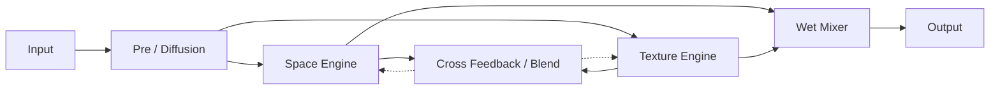

This diagram is **not authorization to implement dual engines**.

Require evidence that the simpler architecture cannot achieve the desired sonic range.

---

# 40. Development Milestones

A likely development sequence is:

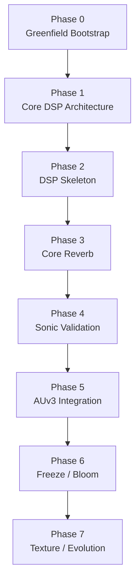

Astra may split, reorder, or revise milestones when technical evidence warrants it.

This charter does not require every milestone to be executed exactly as shown.

---

# 41. Greenfield Bootstrap Principle

Because Aetherfield begins without an existing repository, Phase 0 should establish only the minimum engineering foundation necessary to prove:

**CODE → BUILD → TEST → RENDER → INSPECT**

A trivial gain or passthrough DSP processor is sufficient.

Do not begin sophisticated reverb development until this engineering loop is proven.

A conceptual early architecture may therefore be only:

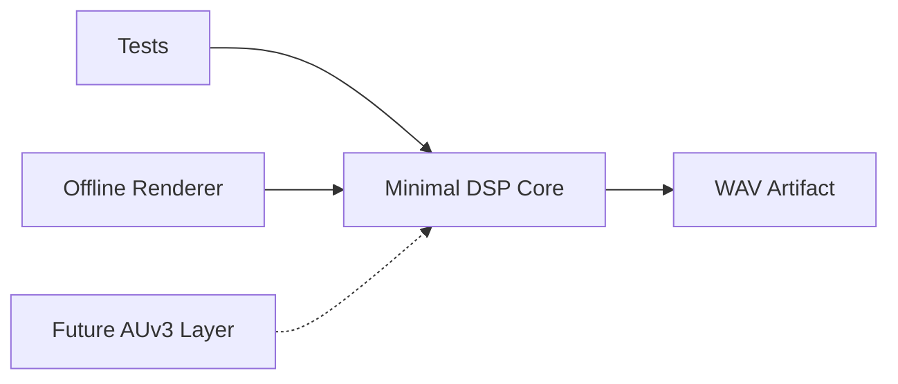

Documentation must clearly show that future components remain unimplemented.

---

# 42. Feature Development Loop

Once the core architecture exists, consequential DSP features should normally follow:

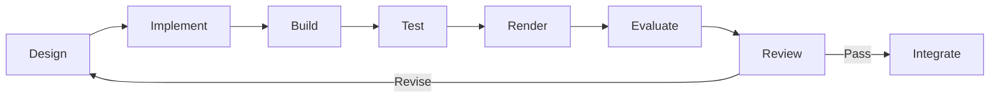

Do not implement several speculative DSP ideas simultaneously when doing so would make their audible effects difficult to isolate.

---

# 43. Decision Rules

Whenever choosing between:

**A. More features**

and

**B. A smaller architecture that sounds excellent and is easy to understand**

prefer **B**.

Whenever choosing between:

**A. Clever DSP**

and

**B. Mathematically understandable, stable DSP with excellent perceptual results**

prefer **B** unless experimentation demonstrates a meaningful advantage.

Whenever choosing between:

**A. Another abstraction**

and

**B. Clear concrete implementation**

prefer **B** until repeated requirements justify abstraction.

Whenever choosing between:

**A. Following this charter literally**

and

**B. Deviating because empirical evidence demonstrates a better solution**

choose the evidence-backed solution and document the decision.

This charter should guide engineering judgment, not replace it.

---

# 44. Definition of Done

Code existing is not completion.

For architecturally consequential work, completion should approximately mean:


Not every trivial patch requires every stage.

Consequential DSP and architectural changes generally do.

---

# 45. Core Reverb Milestone

The first major sonic milestone is not "feature complete."

It is:

> A clean DSP core capable of transforming a simple piano, synth pad, pluck, guitar, or percussion input into a convincing, extremely spacious, smooth and slowly evolving ambient field.

Expected qualities include:

- stable long decay
- smooth diffusion
- useful stereo image
- subtle movement
- absence of obvious zipper noise
- no NaN/Inf under stress testing
- deterministic offline tests
- reference rendering capability
- sensible behavior across supported sample rates
- understandable architecture
- accurate documentation
- consequential decisions captured as ADRs
- musically useful sound before Bloom, Texture, shimmer, or elaborate UI are required

---

# 46. Scope Discipline

Aetherfield should grow through **evidence-backed increments**.

Do not add a feature simply because:

- a reference product has it
- an agent suggested it
- implementation appears easy
- the DSP technique is interesting
- it makes the feature list longer

Ask instead:

> Does this materially improve Aetherfield's musical identity or engineering foundation?

If not, defer or reject it.

---

# 47. North Star

The project succeeds when Aetherfield develops a recognizable character of its own.

The goal is not:

> Build an AUv3 containing many ambient reverb features.

The goal is:

> Build an ambient instrument-effect whose reverberant field feels deep, alive, playable, evolving, and musically compelling — using the smallest coherent architecture capable of producing that experience.

**Sound first. Architecture in service of sound. Features only when they earn their place.**
