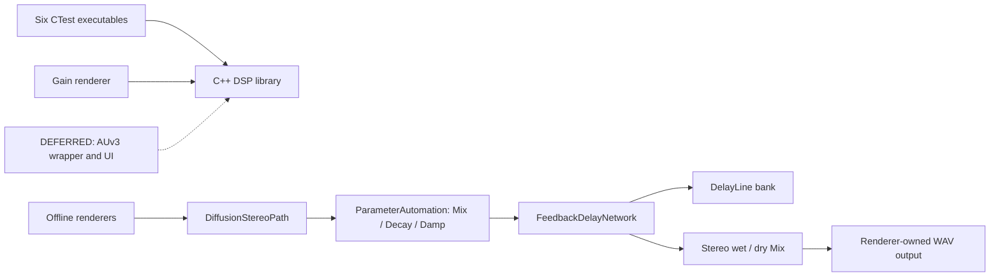

# Architecture

## Current system — IMPLEMENTED

Aetherfield has a portable C++20 DSP core and host-side engineering loop. Its
implemented Phase 1 evaluation path combines input/output diffusion, a fixed
feedback delay network, stereo extraction, and Mix/Decay/Damp automation.
AUv3 integration and the product wrapper remain unimplemented. See [current
status](start-here.md) and [DSP contracts](dsp-design.md).

Solid relationships describe existing code; dashed relationships describe
future work. The DSP library contains gain, delay, network, automation and
DS-B evaluation-path components. The diagram expands offline renderer
composition; it is not an AUv3 or product-wrapper diagram.

## Boundaries

- DSP: standard C++ only. Gain is stateless; delay/network history and parameter
  storage are allocated during preparation, outside processing. The caller
  owns sample buffers and determines block size.
- Parameters: `ParameterAutomation` validates control targets, publishes them
  through single-writer/single-reader atomic transport, and advances coefficient
  ramps on the render thread. Mix is applied outside network feedback.
- Tests: six host executables exercise gain, delay, fixed-network, parameter,
  allpass and diffusion/stereo evaluation contracts without an Apple host or
  external test framework.
- Renderers: own fixtures, dry/wet composition, file I/O and WAV output. The
  mono reverb renderer is an S2/PT observation fixture; the two DS-B render
  tools exercise the implemented evaluation path, not a product wrapper.
- Future platform wrapper: will own Apple buffers, lifecycle, parameter events,
  state and UI integration. Native Apple APIs versus JUCE is now decided
  ([ADR-007](decisions/ADR-007-auv3-integration-comparison.md), accepted
  2026-09-18, in favor of native Apple APIs); the portable core must not
  include Apple or framework types either way, and no wrapper/UI/dependency
  code is authorized by this decision.

## Build and ownership

CMake builds the DSP library and host executables; CTest runs deterministic tests. No dependency downloads or generated plugin scaffold are required. ADR-001 in [decisions.md](decisions.md) records the alternatives and rationale. Host build evidence does not prove iOS deployment or realtime performance.

Astra accepts milestones and maintains scope. Sol reviews consequential architecture and realtime decisions; Terra implements approved increments; Luna independently checks builds, tests, artifacts and documentation. The charter and repository documents are durable handoffs.

These four roles are a division of responsibility and review discipline, not a binding to any specific AI vendor, tool or model. Any sufficiently capable coding agent or model may execute a role, and the project has in practice been continued across more than one tool. Whichever tool is in use should assign each role capability and reasoning effort commensurate with the consequence of its decisions, not uniformly:

- **Sol** carries the highest bar. Its decisions are architectural and safety-consequential (topology, stability proofs, numerical bounds) and are expensive to unwind once implementation builds on them; it should run the most capable model/effort the executing tool offers.
- **Terra** needs strong implementation and design-translation ability, but works from decisions Sol has already made; a capable general-purpose coding model at standard effort is typically sufficient.
- **Luna** performs independent, mostly mechanical verification (rerunning commands, checking claims against files on disk, spot-checking arithmetic and citations); a fast, lighter model is usually adequate, provided it still checks primary sources rather than trusting another agent's self-report.
- **Astra** owns orchestration, cross-domain synthesis, scope/milestone gatekeeping, and reconciling conflicting outputs from the other three roles — not a uniformly narrow job. A model built for coordination/agentic-orchestration work is the right match on its own terms, not a cost-driven downgrade from Terra or Sol; describing it as "light" alongside Luna's mechanical verification work mischaracterizes what the role actually does.

A session's actual model/tool choices are an execution detail of that session, not part of this document; they belong in that session's own commit messages or logs, not here. [docs/agent-log.md](agent-log.md) derives a consolidated, per-milestone index from that history, for any tool or human resuming the project cold (see AETHERFIELD_SPEC.md §25 "Resuming work / session handoff"). A **recommended** concrete model/effort pairing (kept in one place to avoid drift between two copies) lives in AETHERFIELD_SPEC.md §7 — as of this writing: Astra/Fable 5.1, Sol/Opus 5, Terra/Sonnet 5, Luna/Haiku 4.5.

## Deliberately absent — DEFERRED

Modulation, AUv3 wrapper, containing app, UI, signing configuration, presets,
external DSP dependencies, and a product signal path. ADR-006's fixed
diffusion/stereo **evaluation baseline** is implemented, measured and has no
remaining review-triggered revision; it is not product authorization. No
mono-only product requirement follows from the mono host fixture.
