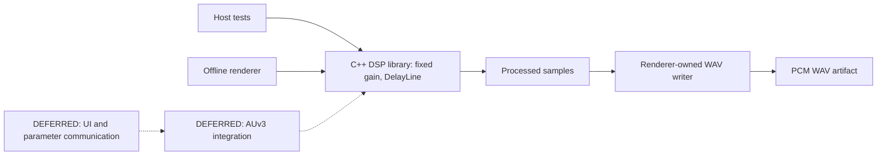

# Architecture

## Current system — IMPLEMENTED

Aetherfield is a greenfield AUv3 audio effect targeting iOS/iPadOS. Phase 0 implements only a portable C++ engineering loop. It is not yet an Audio Unit or a reverb.

Solid relationships describe current code; dashed relationships describe future integration. File I/O belongs to the host renderer, never the DSP core. `DelayLine` (Phase 1 S1) is exercised only by its own test executable so far; the renderer still uses only the Phase 0 gain fixture.

## Boundaries

- DSP: standard C++ only; caller owns sample storage. A concrete stateless in-place gain function processes one contiguous channel, and a small stateful `DelayLine` class (single fixed-length line, no feedback) owns its own delay-history storage internally, allocated only in `prepare()`. The caller determines channel layout and block size.
- Tests: exercise actual DSP behavior without an Apple host or external test framework.
- Renderer: constructs a deterministic fixture, invokes the same DSP library, and writes a WAV from the offline thread. Its allocation and file operations are not render-thread code.
- Parameters: the gain scalar is a bootstrap input passed by value, fixed for each call. It is not a public Aetherfield parameter. There is no shared mutable parameter state, host/UI communication, smoothing, or automation implementation.
- Future platform wrapper: owns Apple buffers, lifecycle, parameter events, state and UI integration. Native Apple APIs versus JUCE remains an integration decision; implementation and integration proof are deferred. The portable core must not include Apple or framework types.

## Build and ownership

CMake builds the DSP library and host executables; CTest runs deterministic tests. No dependency downloads or generated plugin scaffold are required. ADR-001 in [decisions.md](decisions.md) records the alternatives and rationale. Host build evidence does not prove iOS deployment or realtime performance.

Astra accepts milestones and maintains scope. Sol reviews consequential architecture and realtime decisions; Terra implements approved increments; Luna independently checks builds, tests, artifacts and documentation. The charter and repository documents are durable handoffs.

These four roles are a division of responsibility and review discipline, not a binding to any specific AI vendor, tool or model. Any sufficiently capable coding agent or model may execute a role, and the project has in practice been continued across more than one tool. Whichever tool is in use should assign each role capability and reasoning effort commensurate with the consequence of its decisions, not uniformly:

- **Sol** carries the highest bar. Its decisions are architectural and safety-consequential (topology, stability proofs, numerical bounds) and are expensive to unwind once implementation builds on them; it should run the most capable model/effort the executing tool offers.
- **Terra** needs strong implementation and design-translation ability, but works from decisions Sol has already made; a capable general-purpose coding model at standard effort is typically sufficient.
- **Luna** performs independent, mostly mechanical verification (rerunning commands, checking claims against files on disk, spot-checking arithmetic and citations); a fast, lighter model is usually adequate, provided it still checks primary sources rather than trusting another agent's self-report.
- **Astra** performs lightweight scope/milestone gatekeeping against the roadmap and charter; a fast, lighter model is typically adequate here too, since the judgment required is narrow (in-scope or not) rather than open-ended.

A session's actual model/tool choices are an execution detail of that session, not part of this document; they belong in that session's own commit messages or logs, not here. [docs/agent-log.md](agent-log.md) derives a consolidated, per-milestone index from that history, for any tool or human resuming the project cold (see AETHERFIELD_SPEC.md §25 "Resuming work / session handoff").

## Deliberately absent — DEFERRED

The feedback network (matrix, multiple coupled lines, per-line damping and decay), modulation, production lifecycle APIs, lock-free parameter transport, AUv3 wrapper, containing app, UI, platform project, signing configuration, presets and external DSP dependencies. A single fixed-length `DelayLine` primitive (Phase 1 S1) is implemented, but it is not wired into any feedback path and is not a reverb. No mono-only product requirement follows from the mono bootstrap fixture.
